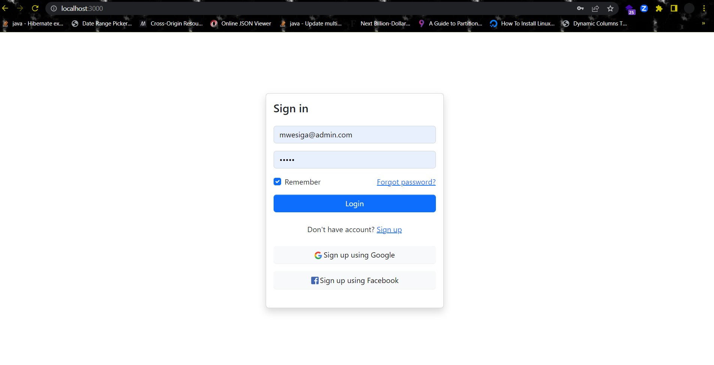
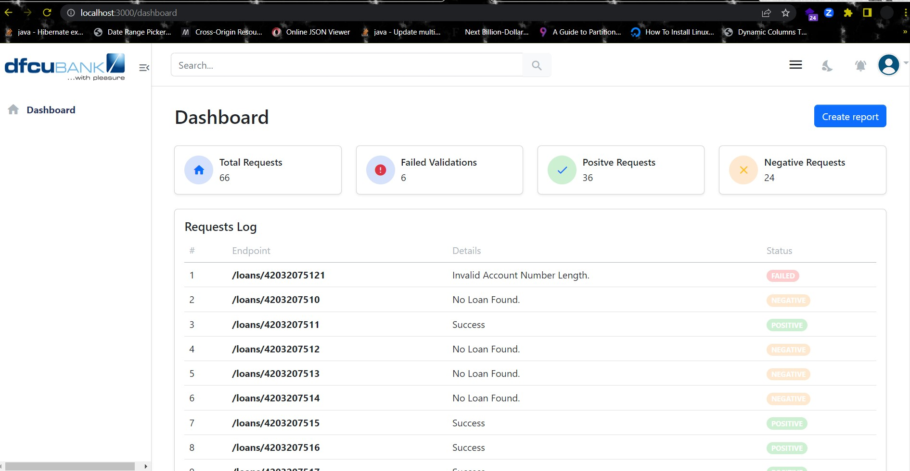
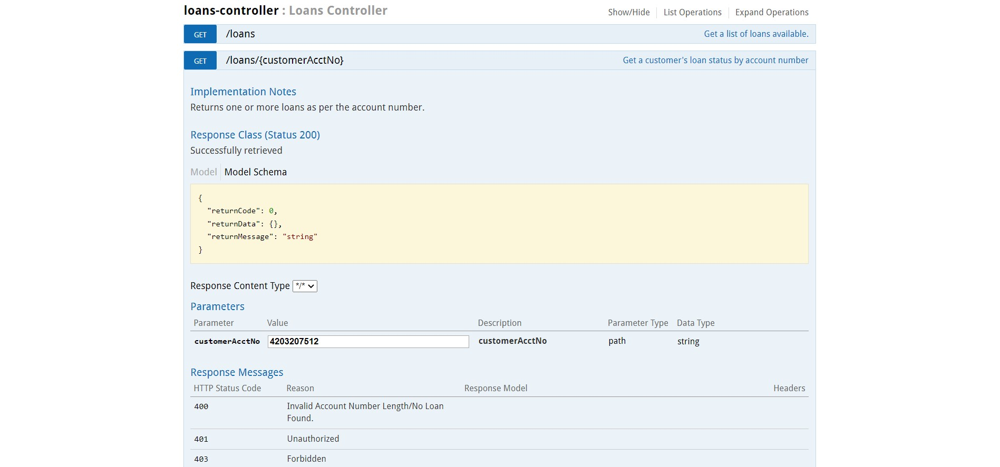
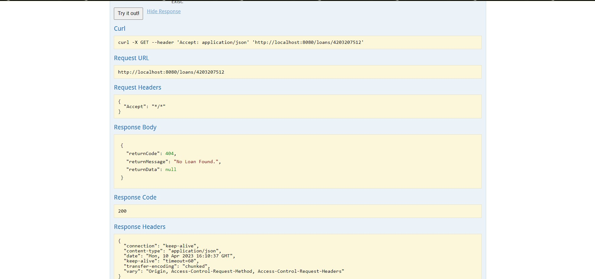

# DFCU Bank Loan Status API

DFCU API is a REST API developed in Springbot Java. It is coupled with an admin interface for tracking API performance.
We have used H2 Database. This is  lightweight and portable database that enables developers develop applications fast. If interested read more about it [here](https://www.h2database.com/html/main.html).
The API has been set up with initial data in the following tables;

1. Users table: This contains the initial admin user whose username is [mwesiga@admin] and password is [admin].
2. Customers table: This contains sample data of customers with their respective account numbers.
3. Loans table: this contains a list of sample loans.

#### NOTE: 
    This data gets populated when the application starts. 

This API will be consumed by the bank’s online banking platform and will be expected to provide information about a customer’s loan status.

## Features

- Check Customer's Loan Status
- API Performance Dashboard
- Simulator App For Testing


## Install and Run Locally
Clone the project repository from [GitHub](https://www.github.com).

```bash
  git clone https://github.com/mwesigab/DFCU_INTERVIEW.git
  cd DFCU_INTERVIEW/
```

### Backend

Open the project in your favourite text editor/IDE and install all the maven dependencies. This should be pretty straightforward. Learn more [here](https://www.jetbrains.com/help/idea/your-first-spring-application.html). 

Install maven dependencies using the command below using the commandline interface/terminal.
```
  .\mvnw clean install  
  
  OR
  
  Install dependiences using your IDE/text editor e.g. Intellij
```
### FrontEnd

Install dependencies for the frontend application and run the yarn command on your terminal/command line ingterface.

```bash
  cd front-end/
  yarn

```
When the installation of dependencies is finished. 
Run 
```
  yarn start
```
After running the front-end successfully, the welcome screen is restricted admin interface which requires a username and password to login as shown in the screenshot below.



The Dashboard should look like the screenshot below on successful login.



## Documentation

We have used Swagger to document this API. It can be accessed from your local url at the link shown below. This is on an assumption that the backend is fully running on port 8080. 
We have used the embedded Tomcat Server to develop and run this API.

```
http://localhost:8080/swagger-ui.html#/
```


## Usage/Examples And Screenshots

This section describes and shows Sample Screenshots from the API in action.

The screenshot below shows the request made to the API using customer account Number 4203207512 using Swagger.



The screenshot below shows the response from the API for the above customer account number.




## Deployment

The backend and front-end shall be deployed separately. To learn about React App Deployment, learn more [here](https://create-react-app.dev/docs/deployment/).

To deploy the Java Springboot application, create a jar file using the following steps.

1. Navigate to the project root directory and run the command below to package the application

```bash
  .\mvnw clean package
```
NOTE: Make sure all the units are passing otherwise the project won't build successfully.

2. A jar file will be created under the target folder. Copy the .jar file and deploy it on a server with Java installed. Run the command below to run it.

```
    java -jar file.jar
```
3. The embedded Tomcat server will start your API , and it will run on the default port 8080. 

4. You can now invoke the API endpoints using the path/url to where the application is deployed.


## Tech Stack

**FrontEnd:** React, Bootstrap

**BackEnd:** Java Springboot


## Authors

- [@mwesigab](https://www.github.com/mwesigab)

